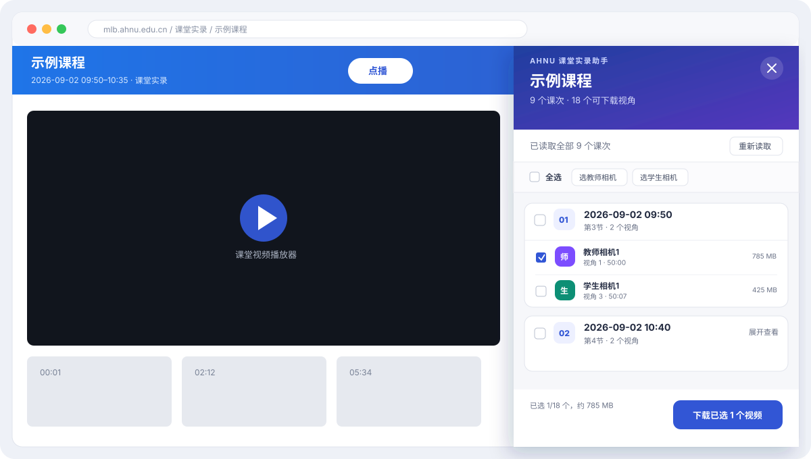

<div align="center">

# AHNU 课堂实录助手

**在一个面板里看清整门课程的课次与相机视角，再决定下载什么。**

[](https://github.com/fenbuxishu/ahnu-classroom-video-picker/releases/latest)
[](https://github.com/fenbuxishu/ahnu-classroom-video-picker/actions/workflows/validate.yml)
[](manifest.json)
[](LICENSE)

[下载最新版](https://github.com/fenbuxishu/ahnu-classroom-video-picker/releases/latest) · [安装方法](#安装) · [使用方法](#使用) · [权限与隐私](#权限与隐私)

</div>

> [!IMPORTANT]
> 这是社区维护的非官方工具，与安徽师范大学无隶属或背书关系。请只处理自己有权访问和使用的课程内容，并遵守学校规定、版权要求与课堂成员隐私。



## 它解决什么问题

原课堂实录页面以单个课次为中心，跨课次查找教师/学生相机视频比较费时。本扩展把当前课程的全部课次和可用视角整理到同一个侧边面板，用户可以先查看时长与容量，再按需勾选。

| 总览 | 选择 | 下载 |
| --- | --- | --- |
| 汇总整门课程的全部课次 | 按课次、教师相机或学生相机勾选 | 交给 Chrome 下载并自动整理文件名 |

## 主要功能

- **课程级总览**：一次读取当前课程的全部课次；
- **视角分类**：区分教师相机、学生相机及视角编号；
- **下载前确认**：显示时长、文件大小和已选总容量；
- **灵活勾选**：支持全选、按课次选择、只选教师或学生相机；
- **自动归档**：按课程、日期/节次和相机视角组织下载路径；
- **即时地址**：每次从当前登录会话读取临时视频地址，不保存历史链接；
- **本地优先**：零遥测、无外部服务、无账号系统。

## 安装

### 1. 下载 Chrome 构建

从 [Latest Release](https://github.com/fenbuxishu/ahnu-classroom-video-picker/releases/latest) 下载：

```text
ahnu-classroom-video-picker-chrome-mv3.zip
```

这是用于 Chrome 开发者模式的 **Manifest V3 未签名构建**，不是可双击运行的 macOS 安装程序，也不是 Chrome Web Store 安装包。

### 2. 加载扩展

1. 解压 ZIP；
2. 在 Chrome 地址栏打开 `chrome://extensions/`；
3. 打开右上角的“开发者模式”；
4. 点击“加载已解压的扩展程序”；
5. 选择解压得到的 `ahnu-classroom-video-picker` 文件夹。

> 从源码安装时，可以直接克隆本仓库，并在第 5 步选择仓库目录。

## 使用

1. 登录相关校园系统并打开某门课程的“课堂实录”页面；
2. 刷新页面，右侧会自动出现 **AHNU 课堂实录助手**；
3. 浏览课次与相机视角，按需勾选；
4. 检查底部显示的数量与预计容量；
5. 点击“下载已选视频”。

面板收起后，可以从页面右下角的“视频总览”按钮或 Chrome 工具栏中的扩展按钮重新打开。

### 下载目录

```text
下载/
└── 课堂实录/
    └── 课程名/
        └── 课次日期_节次/
            ├── 教师相机1_视角1.mp4
            └── 学生相机1_视角3.mp4
```

实际根目录由 Chrome 下载设置决定。如果启用了“下载前询问每个文件的保存位置”，批量下载时浏览器会逐个询问。

## 权限与隐私

本扩展只申请完成核心功能所需的权限：

| 权限 | 为什么需要 |
| --- | --- |
| `downloads` | 下载用户主动勾选的视频，并设置可读的分类文件名 |
| `https://mlb.ahnu.edu.cn/*` | 在课堂实录页面显示面板，并读取当前账号有权访问的课次信息 |
| `https://dbfw.ahnu.edu.cn/*` | 获取视频大小，并下载用户勾选的视频 |

**扩展不会：**

- 收集或上传账号、Cookie、课程信息；
- 把视频地址发送给第三方服务；
- 保存带鉴权参数的历史视频链接；
- 在用户未点击下载时自动下载视频；
- 注入广告、遥测或统计代码。

更完整的安全边界与报告方式见 [SECURITY.md](SECURITY.md)。

## 常见问题

<details>
<summary><strong>页面没有出现侧边面板</strong></summary>

确认当前地址是具体课程的课堂实录播放页面，然后在 `chrome://extensions/` 重新加载扩展并刷新课程页面。

</details>

<details>
<summary><strong>文件大小一直显示“待获取”</strong></summary>

文件大小来自视频服务器的响应头。服务器暂时不可达时，大小可能无法显示，但只要视频地址仍有效，勾选和下载功能不受影响。

</details>

<details>
<summary><strong>为什么下载链接过一段时间会失效</strong></summary>

视频服务器返回带临时鉴权参数的地址。点击“重新读取”即可从当前登录会话获取新地址。

</details>

<details>
<summary><strong>支持 Edge、Brave 等 Chromium 浏览器吗</strong></summary>

扩展使用标准 Manifest V3 API，理论上兼容 Chromium 浏览器；当前正式验证环境为 macOS 上的 Google Chrome。

</details>

## 开发

项目不依赖构建工具或第三方运行时，仓库根目录就是可加载的扩展：

```text
manifest.json   扩展清单与权限
content.js      课次读取、页面面板与选择交互
panel.css       页面面板样式
background.js   下载任务与文件命名
```

提交前运行：

```bash
node --check content.js
node --check background.js
jq empty manifest.json
```

生成与 Release 一致的最小 Chrome 构建和 SHA-256 校验文件：

```bash
./scripts/package.sh
```

贡献约定见 [CONTRIBUTING.md](CONTRIBUTING.md)，版本变化见 [CHANGELOG.md](CHANGELOG.md)。

## 免责声明

本项目仅提供浏览器端的课程资源整理与下载操作界面，不绕过登录、访问控制或视频鉴权。使用者应确保拥有相应资源的访问和使用权限，并自行承担保存、传播或处理课程录像所产生的责任。

## License

[MIT](LICENSE) © 2026 fenbuxishu
